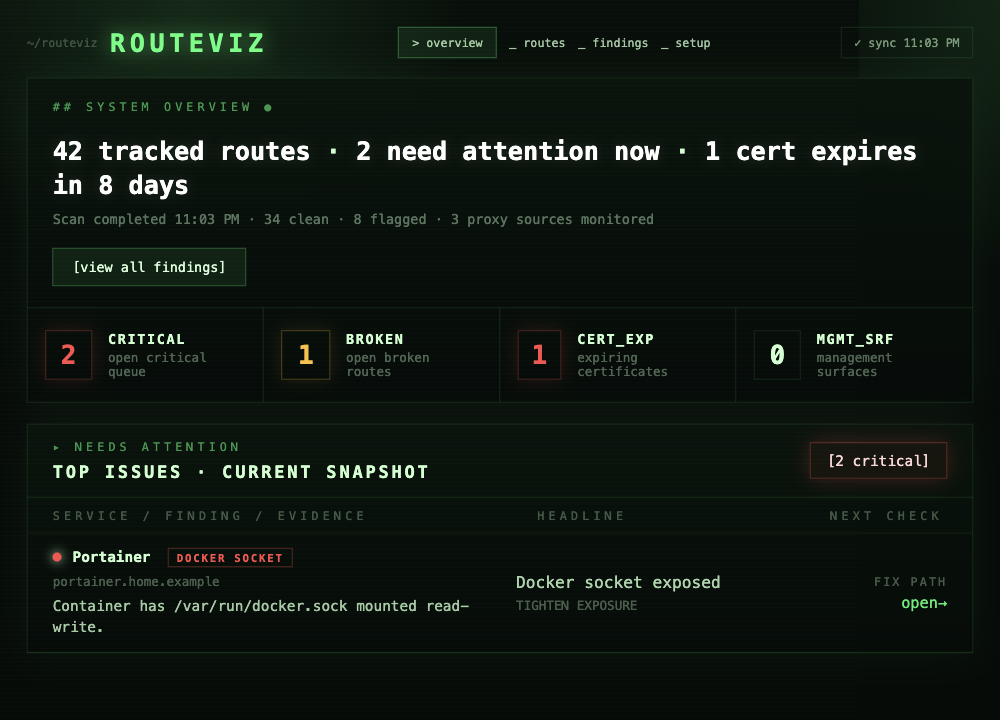

<div align="center">

  <h1>Routeviz</h1>

  <p>Routeviz is a free and open-source exposure chain monitor for homelabs and self-hosted stacks.<br/>It maps every route from public entrypoint → reverse proxy → upstream target → live container, then flags what's broken or risky.</p>

  <p>
    <a href="https://github.com/parmeetdx/routeviz/releases"><strong>Get Started</strong></a>
    ·
    <a href="https://github.com/parmeetdx/routeviz/blob/main/CONTRIBUTING.md"><strong>Contributing</strong></a>
    ·
    <a href="https://github.com/parmeetdx/routeviz/issues"><strong>Report a Bug</strong></a>
  </p>

  <p>
    
    
    
    
  </p>

  

</div>

---

## Features

**Exposure chain mapping**

- Maps every route from public domain → reverse proxy → upstream target → live container
- Matches routes to running Docker containers with confidence scoring
- Shows the full chain — proxy host, target, workload, networks, and ports

**Findings**

- Unmatched or dead-target routes
- Unauthenticated public endpoints
- DNS drift and resolution failures
- Expiring and expired TLS certificates
- Exposed Docker socket mounts and privileged containers

**Operations**

- Scheduled and manual scans
- Change tracking between snapshots
- Webhook alerts on new high-severity findings
- Exposure intent overrides — mark routes as intentionally public, auth-required, or private

---

## Quick Start

**Prerequisites:** Docker and Docker Compose on the host running your services.

```bash
# 1. Download the compose file and example env
curl -O https://raw.githubusercontent.com/parmeetdx/routeviz/main/docker-compose.yml
curl -O https://raw.githubusercontent.com/parmeetdx/routeviz/main/.env.example
cp .env.example .env

# 2. Set HOST_ADDRESS to your host's LAN IP
#    Run: hostname -I | awk '{print $1}'
nano .env

# 3. Start
docker compose up -d

# 4. Open http://<your-host-ip>:8141
```

On first launch you'll be prompted to create an account, then connect your reverse proxy in Setup.

---

## Connectors

| Connector | Status | Notes |
|---|---|---|
| Nginx Proxy Manager | ✅ Ready | API mode (recommended) or SQLite bind-mount |
| Docker | ✅ Ready | Reads running containers via Docker socket |
| DNS | ✅ Ready | Resolves public answers per route |
| Traefik | 🔜 Coming soon | — |
| Caddy | 🔜 Planned | — |

---

## Tech Stack

| Category | Technology |
|---|---|
| Framework | Next.js 16 (App Router) |
| Language | TypeScript |
| Database | PostgreSQL |
| Styling | Tailwind CSS v4 |
| Runtime connector | Docker socket API |
| Tests | Vitest |

---

## Configuration

All settings are managed through the Setup UI. The `.env` file only controls infrastructure-level options:

| Variable | Default | Description |
|---|---|---|
| `HOST_ADDRESS` | *(auto-detected)* | Your host's LAN IP — required in most Docker setups |
| `PORT` | `8141` | Port Routeviz listens on |
| `POSTGRES_PASSWORD` | `changeme` | Password for the internal Postgres instance |
| `NPM_DATA_PATH` | — | SQLite mode only — path to your NPM data directory on the host |

---

## Development

```bash
# Prerequisites: Node 20+, Postgres
cp .env.example .env.local
# Set DATABASE_URL in .env.local

npm install
npm run dev
# Open http://localhost:3000
```

```bash
npm test           # run test suite
npx tsc --noEmit   # type check
```

See [CONTRIBUTING.md](CONTRIBUTING.md) for full setup and connector authoring guide.

---

## Contributing

Contributions are welcome — bug fixes, new connectors, UI improvements, or docs.

1. Fork the repository
2. Create a feature branch (`git checkout -b feat/traefik-connector`)
3. Commit your changes
4. Push and open a Pull Request

See [CONTRIBUTING.md](CONTRIBUTING.md) for detailed instructions.

---

## License

[MIT](LICENSE) — do whatever you want with it.
